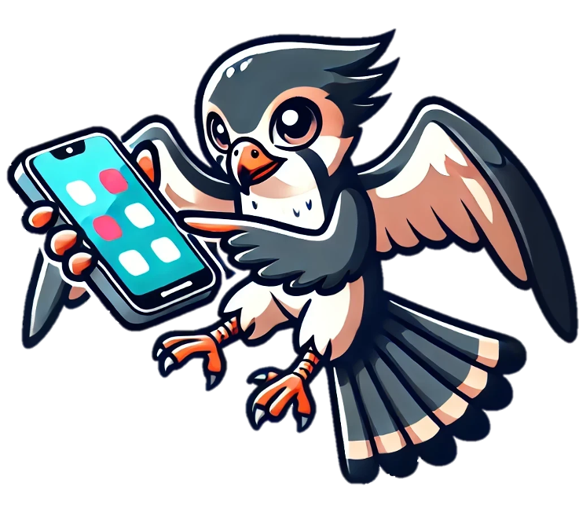

<div align="center">
  <h1 style="display: inline-block; font-size: 32px;">
  <p align="center">
    
    UI-Hawk: Unleashing the Screen Stream Understanding for GUI Agents
  <p>
  </h1>
</div>
<p align="center"><strong>Jiwen Zhang<sup>1,2*</sup> , Yaqi Yu<sup>2*</sup>  , Minghui Liao<sup>2</sup>  , Wentao Li<sup>2</sup>, Jihao Wu<sup>2</sup>  ,  Zhongyu Wei<sup>1</sup>.
 </strong></p>
<p align="center"><sup>1</sup>Fudan University  <sup>2</sup>Huawei Inc.</p>
<p align="center">
    <a href="https://github.com/IMNearth/UIHawk/tree/main/assets/UIHawk_preprint.pdf"></a>
    <a href="https://www.preprints.org/manuscript/202408.2137/v1"></a>
</p>

--------------

This work presents **UI-Hawk**, a visual GUI agent specially designed to processing *screen streams* encountered during GUI navigation. UI-Hawk incorporates a history-aware visual encoder and an efficient resampler to handle the screen sequences. To acquire a better understanding of screen streams, we define four fundamental tasks—UI grounding, UI referring, screen question answering, and screen summarization. We develop an automated data curation method to generate the corresponding training data for UI-Hawk. Along with the efforts above, we have also created a benchmark FunUI to quantitatively evaluate the fundamental screen understanding ability of MLLMs. Extensive experiments on FunUI and GUI navigation benchmarks consistently validate that screen stream understanding is not only beneficial but also essential for GUI navigation.

<div align="center">
    
</div>


## 📣 Update

- **[2024-08-30]** We have our paper online, you can access the [preprint](https://www.preprints.org/manuscript/202408.2137/v1) or directly get the PDF at [here](https://github.com/IMNearth/UIHawk/tree/main/assets/UIHawk_preprint.pdf) !


## Model Architecture

UI-Hawk is a MLLM-based GUI agent equipped with screen stream understanding capabilities. It is built upon [TextHawk](https://github.com/yuyq96/TextHawk). To harness the screen sequences, UI-Hawk incorporates a history-aware visual encoder, which explicitly models the temporal dependencies of images via scalable position embeddings. We utilize an efficient resampler with a compression ratio of 16, enabling UI-Hawk to handle multiple steps of history screens. This meticulous architecture design empowers UI-Hawk to effectively perceive the fine-grained details involved in the entire navigation process.

<div align="center">
    
</div>

## FunUI Benchmark

We introduce **FunUI**, a bilingual evaluation benchmark to evaluate the fundamental screen understanding capabilities of MLLMs. Concretely, FunUI enjoys the following three characteristics:

* ***Bilingual***: FunUI comprises of 2150 Chinese screens and 9347 English screens from Android devices, annotated with 14k and 18k samples, respectively. 
* ***Comprehensive***: FunUI includes different evaluation dimensions of screen understanding, including UI grounding and UI referring tasks to access the regional location and identification abilities of models, together with screen question answering and screen summarization tasks that require more integrated analysis of screen contents.
* ***Diverse***: FunUI covers various types of question answering pairs, including grounding and referring questions about 120+ icons and widgets, and complex questions with related to elements relations, attributions, arithmetics and so on. 


<div align="center">
    
</div>

## Experiment Results

UI-Hawk is a bilingual model with advanced screen understanding capabilities and achieves new SOTA on episodic GUI navigation.

| **Model**        | **Tool** | **Information** | **Shopping** | **Media** | **Social** | **Multi-Apps** | **Overall** | **ClickAcc** |
| :---------------- | :-------: | :-------: | :-------: | :-------: | :-------: | :-------: | :-------: | :-------: |
| **GPT-4V**       | 10.6     | 9.8             | 11.2         | 7.6       | 5.0        | 11.2           | 9.2         | 3.4          |
| **CogAgent**     | 12.9     | 10.0            | 14.2         | 10.5      | 9.0        | 8.4            | 10.3        | 7.5          |
| **SeeClick**     | 6.8      | 6.4             | 5.8          | 7.2       | 8.1        | 5.5            | 6.5         | 6.5          |
| **OdysseyAgent** | 81.5     | 63.6            | 62.2         | 72.5      | 72.5       | 68.8           | 70.8        | 43.8         |
| **UI-Hawk**      | 88.2     | 70.9            | 66.8         | 82.4      | 81.4       | 80.1           | 79.4        | 76.3         |

<p align="left"> Table 2: Sequential navigation performance on GUI-Odyssey+ dataset. </p>


## Citation

If you find our work helpful, please consider citing our paper.

```
@article{202408.2137,
    title = {UI-Hawk: Unleashing the Screen Stream Understanding for GUI Agents},
    author = {Jiwen Zhang and Yaqi Yu and Minghui Liao and Wentao Li and Jihao Wu and Zhongyu Wei},
    doi = {10.20944/preprints202408.2137.v1},
    url = {https://doi.org/10.20944/preprints202408.2137.v1},
    year = 2024,
    month = {August},
    publisher = {Preprints},
    journal = {Preprints}
}
```

